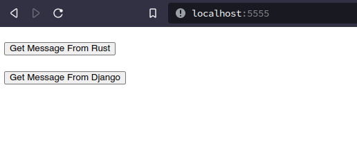
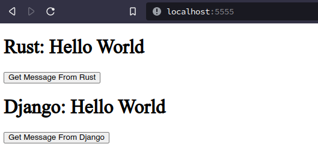

# Starter-JS-Rust-Python-FullStack

Demo program for 

backend: 

- Rust (Axum)
- Python (Django)

frontend:

- HTML
- Pure JavaStript

containerization:

- docker

## How to Run?
- Make sure you have docker and docker-compose installed
- Run command `docker-compose up` in home directory of the project
- Access through browser in `localhost:5555`

## Snapshots 

